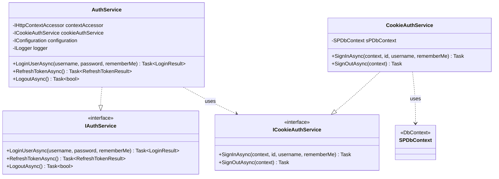
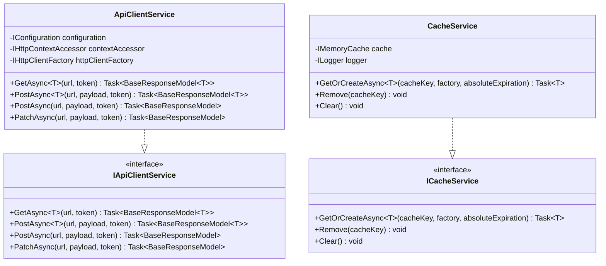
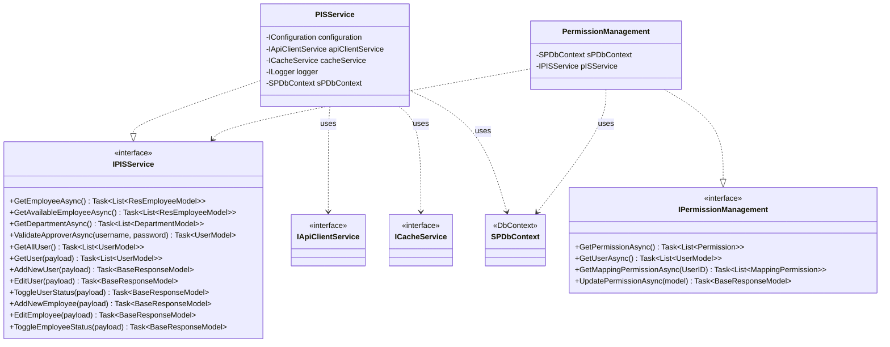
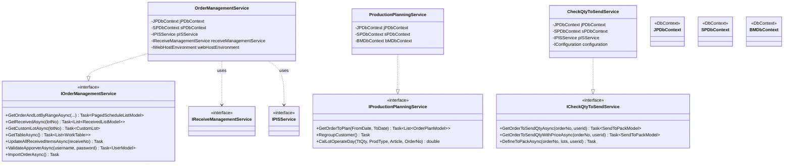
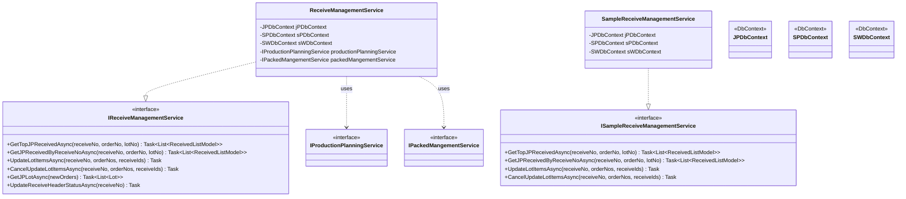
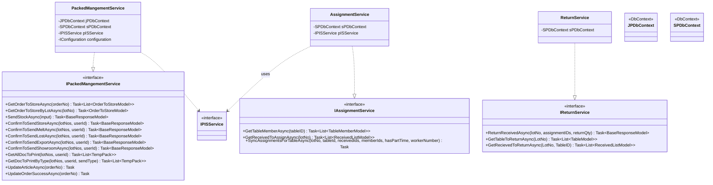
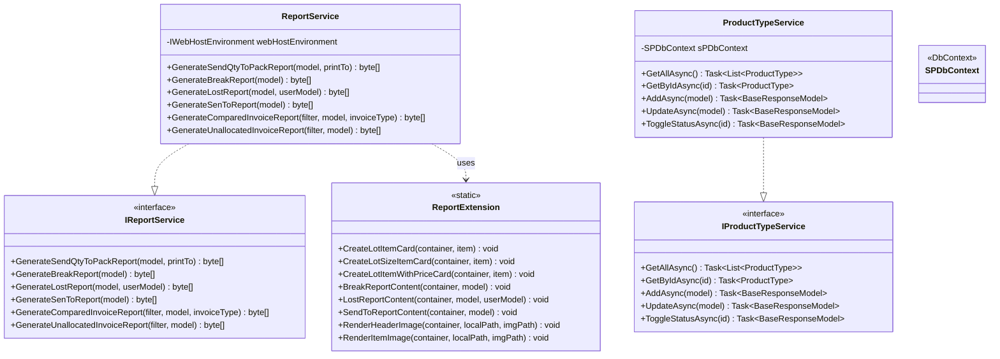

# Class Diagram - Service Layer

## Overview (Architecture)

```mermaid
classDiagram
    direction TB

    %% ===== DbContexts =====
    class SPDbContext { <<DbContext>> }
    class JPDbContext { <<DbContext>> }
    class SWDbContext { <<DbContext>> }
    class BMDbContext { <<DbContext>> }

    %% ===== Auth Group =====
    class IAuthService { <<interface>> }
    class ICookieAuthService { <<interface>> }
    class AuthService
    class CookieAuthService

    AuthService ..|> IAuthService
    CookieAuthService ..|> ICookieAuthService
    AuthService ..> ICookieAuthService : uses

    %% ===== Infrastructure =====
    class IApiClientService { <<interface>> }
    class ICacheService { <<interface>> }
    class ApiClientService
    class CacheService

    ApiClientService ..|> IApiClientService
    CacheService ..|> ICacheService

    %% ===== PIS / User =====
    class IPISService { <<interface>> }
    class IPermissionManagement { <<interface>> }
    class PISService
    class PermissionManagement

    PISService ..|> IPISService
    PermissionManagement ..|> IPermissionManagement
    PISService ..> IApiClientService : uses
    PISService ..> ICacheService : uses
    PISService ..> SPDbContext : uses
    PermissionManagement ..> IPISService : uses
    PermissionManagement ..> SPDbContext : uses

    %% ===== Order & Lot =====
    class IOrderManagementService { <<interface>> }
    class IProductionPlanningService { <<interface>> }
    class ICheckQtyToSendService { <<interface>> }
    class OrderManagementService
    class ProductionPlanningService
    class CheckQtyToSendService

    OrderManagementService ..|> IOrderManagementService
    ProductionPlanningService ..|> IProductionPlanningService
    CheckQtyToSendService ..|> ICheckQtyToSendService

    OrderManagementService ..> JPDbContext : uses
    OrderManagementService ..> SPDbContext : uses
    OrderManagementService ..> IPISService : uses
    OrderManagementService ..> IReceiveManagementService : uses

    ProductionPlanningService ..> JPDbContext : uses
    ProductionPlanningService ..> SPDbContext : uses
    ProductionPlanningService ..> BMDbContext : uses

    CheckQtyToSendService ..> JPDbContext : uses
    CheckQtyToSendService ..> SPDbContext : uses
    CheckQtyToSendService ..> IPISService : uses

    %% ===== Receive =====
    class IReceiveManagementService { <<interface>> }
    class ISampleReceiveManagementService { <<interface>> }
    class ReceiveManagementService
    class SampleReceiveManagementService

    ReceiveManagementService ..|> IReceiveManagementService
    SampleReceiveManagementService ..|> ISampleReceiveManagementService

    ReceiveManagementService ..> JPDbContext : uses
    ReceiveManagementService ..> SPDbContext : uses
    ReceiveManagementService ..> SWDbContext : uses
    ReceiveManagementService ..> IProductionPlanningService : uses
    ReceiveManagementService ..> IPackedMangementService : uses

    SampleReceiveManagementService ..> JPDbContext : uses
    SampleReceiveManagementService ..> SPDbContext : uses
    SampleReceiveManagementService ..> SWDbContext : uses

    %% ===== Packing =====
    class IPackedMangementService { <<interface>> }
    class PackedMangementService

    PackedMangementService ..|> IPackedMangementService
    PackedMangementService ..> JPDbContext : uses
    PackedMangementService ..> SPDbContext : uses
    PackedMangementService ..> IPISService : uses

    %% ===== Assignment =====
    class IAssignmentService { <<interface>> }
    class IReturnService { <<interface>> }
    class AssignmentService
    class ReturnService

    AssignmentService ..|> IAssignmentService
    ReturnService ..|> IReturnService

    AssignmentService ..> SPDbContext : uses
    AssignmentService ..> IPISService : uses
    ReturnService ..> SPDbContext : uses

    %% ===== Quality Control =====
    class IBreakService { <<interface>> }
    class ILostService { <<interface>> }
    class IAuditService { <<interface>> }
    class ICancelReceiveService { <<interface>> }
    class BreakService
    class LostService
    class AuditService
    class CancelReceiveService

    BreakService ..|> IBreakService
    LostService ..|> ILostService
    AuditService ..|> IAuditService
    CancelReceiveService ..|> ICancelReceiveService

    BreakService ..> JPDbContext : uses
    BreakService ..> SPDbContext : uses
    LostService ..> SPDbContext : uses
    LostService ..> IPISService : uses
    AuditService ..> JPDbContext : uses
    AuditService ..> SPDbContext : uses
    CancelReceiveService ..> JPDbContext : uses
    CancelReceiveService ..> SPDbContext : uses

    %% ===== Report =====
    class IReportService { <<interface>> }
    class IProductTypeService { <<interface>> }
    class ReportService
    class ProductTypeService

    ReportService ..|> IReportService
    ProductTypeService ..|> IProductTypeService
    ProductTypeService ..> SPDbContext : uses
```

---

## Group 1: Authentication

---

## Group 2: Infrastructure / Utility

---

## Group 3: PIS / User / Permission

---

## Group 4: Order & Production Planning

---

## Group 5: Receive Management

---

## Group 6: Packing & Assignment

---

## Group 7: Quality Control & Audit

```mermaid
classDiagram
    class IAuditService {
        <<interface>>
        +GetFilteredInvoice(filter) Task~List~ComparedInvoiceModel~~
        +GetUnallocatedQuentityToStore(filter) Task~List~UnallocatedQuantityModel~~
        +MarkInvoiceAsRead(InvoiceNo, userId) Task~BaseResponseModel~
        +GetConfirmedInvoice(InvoiceNo) Task~List~ComparedInvoiceModel~~
        +GetIsMarked(InvoiceNo) Task~BaseResponseModel~
        +GetSendLostCheckList(filter) Task~List~SendLostCheckModel~~
    }

    class IBreakService {
        <<interface>>
        +GetBreakAsync(filter) Task~List~LostAndRepairModel~~
        +AddBreakAsync(lotNo, breakQty, breakDes) Task
        +GetBreakDescriptionsAsync() Task~List~BreakDescription~~
        +AddNewBreakDescription(breakDescription) Task~List~BreakDescription~~
        +PintedBreakReport(BreakIDs) Task
    }

    class ILostService {
        <<interface>>
        +GetLostAsync(filter) Task~List~LostAndRepairModel~~
        +AddLostAsync(lotNo, lostQty, leaderID) Task
        +PintedLostReport(LostIDs) Task
        +GetTableLeaderAsync(LotNo) Task~List~AssignedWorkTableModel~~
    }

    class ICancelReceiveService {
        <<interface>>
        +GetTopSJ1JPReceivedAsync(receiveNo, orderNo, lotNo) Task~List~ReceivedListModel~~
        +GetSJ1JPReceivedByReceiveNoAsync(receiveNo, orderNo, lotNo) Task~List~ReceivedListModel~~
        +CancelSJ1ByReceiveNoAsync(receiveNo, userId) Task~BaseResponseModel~
        +CancelSJ1ByLotNoAsync(receiveNo, lotNos, userId) Task~BaseResponseModel~
        +GetTopSJ2JPReceivedAsync(receiveNo, orderNo, lotNo) Task~List~ReceivedListModel~~
        +CancelSJ2ByReceiveNoAsync(receiveNo, userId) Task~BaseResponseModel~
        +CancelSJ2ByLotNoAsync(receiveNo, lotNos, userId) Task~BaseResponseModel~
        +GetTopSendLostReceivedAsync(receiveNo, orderNo, lotNo) Task~List~ReceivedListModel~~
        +CancelSendLostByReceiveNoAsync(receiveNo, userId) Task~BaseResponseModel~
        +CancelSendLostByLotNoAsync(receiveNo, lotNos, userId) Task~BaseResponseModel~
        +GetTopExportReceivedAsync(receiveNo, orderNo, lotNo) Task~List~ReceivedListModel~~
        +CancelExportByReceiveNoAsync(receiveNo, userId) Task~BaseResponseModel~
        +CancelExportByLotNoAsync(receiveNo, lotNos, userId) Task~BaseResponseModel~
        +GetTopShowroomReceivedAsync(receiveNo, orderNo, lotNo) Task~List~ReceivedListModel~~
        +CancelShowroomByReceiveNoAsync(receiveNo, userId) Task~BaseResponseModel~
        +CancelShowroomByLotNoAsync(receiveNo, lotNos, userId) Task~BaseResponseModel~
    }

    class AuditService {
        -JPDbContext jPDbContext
        -SPDbContext sPDbContext
    }

    class BreakService {
        -JPDbContext jPDbContext
        -SPDbContext sPDbContext
    }

    class LostService {
        -SPDbContext sPDbContext
        -IPISService pISService
    }

    class CancelReceiveService {
        -SPDbContext sPDbContext
        -JPDbContext jPDbContext
    }

    AuditService ..|> IAuditService
    BreakService ..|> IBreakService
    LostService ..|> ILostService
    CancelReceiveService ..|> ICancelReceiveService
    LostService ..> IPISService : uses

    class IPISService { <<interface>> }
    class JPDbContext { <<DbContext>> }
    class SPDbContext { <<DbContext>> }
```

---

## Group 8: Report & Master Data

---

## สรุป Service Layer

| กลุ่ม | Interface | Implementation | DbContexts ที่ใช้ |
|---|---|---|---|
| Authentication | IAuthService, ICookieAuthService | AuthService, CookieAuthService | SP |
| Infrastructure | IApiClientService, ICacheService | ApiClientService, CacheService | - |
| PIS / User | IPISService, IPermissionManagement | PISService, PermissionManagement | SP |
| Order & Planning | IOrderManagementService, IProductionPlanningService, ICheckQtyToSendService | OrderManagementService, ProductionPlanningService, CheckQtyToSendService | JP, SP, BM |
| Receive | IReceiveManagementService, ISampleReceiveManagementService | ReceiveManagementService, SampleReceiveManagementService | JP, SP, SW |
| Packing & Assignment | IPackedMangementService, IAssignmentService, IReturnService | PackedMangementService, AssignmentService, ReturnService | JP, SP |
| Quality Control | IAuditService, IBreakService, ILostService, ICancelReceiveService | AuditService, BreakService, LostService, CancelReceiveService | JP, SP |
| Report & Master | IReportService, IProductTypeService | ReportService, ProductTypeService | SP |
