# ER Diagram - SPDB (SPDbContext)

```mermaid
erDiagram

    %% ===== ORDER & LOT =====

    Order {
        string OrderNo PK
        string CustCode
        datetime FactoryDate
        datetime OrderDate
        datetime SeldDate1
        datetime OrdDate
        bool IsSample
        bool IsSuccess
        bool IsActive
    }

    SampleOrder {
        string OrderNo PK
        string CustCode
        datetime FactoryDate
        datetime OrderDate
        datetime SeldDate1
        datetime OrdDate
        bool IsSuccess
        bool IsActive
    }

    Lot {
        string LotNo PK
        string OrderNo FK
        string ListNo
        string CustPcode
        decimal TtQty
        double TtWg
        decimal Si
        string Unit
        string TdesFn
        string EdesFn
        string Article
        string Barcode
        string EdesArt
        string TdesArt
        string MarkCenter
        string SaleRem
        string ImgPath
        double OperateDays
        decimal ReceivedQty
        decimal AssignedQty
        decimal ReturnedQty
        decimal Unallocated
        bool IsSuccess
        bool IsActive
    }

    SampleLot {
        string LotNo PK
        string OrderNo FK
        string ListNo
        string CustPcode
        decimal TtQty
        double TtWg
        decimal Si
        string Unit
        string TdesFn
        string EdesFn
        string Article
        string Barcode
        string EdesArt
        string TdesArt
        bool IsSuccess
        bool IsActive
    }

    OrderNotify {
        int Id PK
        string OrderNo FK
        bool IsNew
        bool IsUpdate
        bool IsActive
        datetime CreateDate
    }

    LotNotify {
        int Id PK
        string LotNo FK
        bool IsUpdate
        bool IsActive
        datetime CreateDate
    }

    %% ===== RECEIVE =====

    Received {
        int ReceivedId PK
        int ReceiveId
        string ReceiveNo
        string LotNo FK
        string Barcode
        int BillNumber
        decimal TtQty
        double TtWg
        datetime Mdate
        bool IsReceived
        bool IsAssigned
        bool IsReturned
        bool IsActive
    }

    SampleRecieved {
        int SampleReceiveId PK
        int ReceiveId
        string ReceiveNo
        string LotNo FK
        string Barcode
        int BillNumber
        decimal TtQty
        double TtWg
        datetime Mdate
        bool IsReceived
        bool IsActive
    }

    %% ===== ASSIGNMENT =====

    Assignment {
        int AssignmentId PK
        int NumberWorkers
        bool HasPartTime
        bool IsReturned
        bool IsActive
        datetime CreateDate
        datetime UpdateDate
    }

    AssignmentReceived {
        int AssignmentReceivedId PK
        int AssignmentId FK
        int ReceivedId FK
        bool IsActive
        datetime CreateDate
        datetime UpdateDate
    }

    AssignmentMember {
        int AssignmentMemberId PK
        int AssignmentReceivedId FK
        int WorkTableMemberId FK
        bool IsActive
        datetime CreateDate
        datetime UpdateDate
    }

    AssignmentTable {
        int AssignmentTableId PK
        int AssignmentReceivedId FK
        int WorkTableId FK
        bool IsActive
        datetime CreateDate
        datetime UpdateDate
    }

    %% ===== WORK TABLE =====

    WorkTable {
        int Id PK
        string Name
        int LeaderId
        bool IsActive
        datetime CreateDate
        datetime UpdateDate
    }

    WorkTableMember {
        int Id PK
        int WorkTableId FK
        int EmpId
        bool IsActive
        datetime CreateDate
        datetime UpdateDate
    }

    %% ===== RETURN =====

    Returned {
        int ReturnId PK
        decimal ReturnTtQty
        bool IsSuccess
        bool IsActive
        datetime CreateDate
        datetime UpdateDate
    }

    ReturnedDetail {
        int ReturnDetailId PK
        int ReturnId FK
        int AssignmentId FK
        bool IsActive
        datetime CreateDate
        datetime UpdateDate
    }

    %% ===== BREAK / MELT =====

    BreakDescription {
        int BreakDescriptionId PK
        string Name
        bool IsActive
        datetime CreateDate
        datetime UpdateDate
    }

    Break {
        int BreakId PK
        int ReceivedId FK
        int BreakDescriptionId FK
        decimal PreviousQty
        double PreviousWg
        decimal BreakQty
        bool IsReported
        bool IsActive
        datetime CreateDate
        datetime UpdateDate
    }

    Melt {
        int MeltId PK
        string LotNo FK
        int BillNumber
        string Doc
        decimal TtQty
        double TtWg
        int BreakDescriptionId FK
        bool IsSended
        bool IsMelted
        bool IsActive
        datetime CreateDate
        int CreateBy
        datetime UpdateDate
        int UpdateBy
    }

    %% ===== EXPORT =====

    Export {
        string Doc PK
        bool IsActive
        datetime CreateDate
        int CreateBy
        datetime UpdateDate
        int UpdateBy
    }

    ExportDetail {
        int ExportId PK
        string LotNo FK
        string Doc FK
        decimal TtQty
        double TtWg
        bool IsOverQuota
        int Approver
        bool IsSended
        bool IsActive
        datetime CreateDate
        int CreateBy
        datetime UpdateDate
        int UpdateBy
    }

    %% ===== SEND LOST =====

    SendLost {
        string Doc PK
        bool IsActive
        datetime CreateDate
        int CreateBy
        datetime UpdateDate
        int UpdateBy
    }

    SendLostDetail {
        int SendLostId PK
        string LotNo FK
        string Doc FK
        decimal TtQty
        double TtWg
        bool IsSended
        bool IsActive
        datetime CreateDate
        int CreateBy
        datetime UpdateDate
        int UpdateBy
    }

    Lost {
        int LostId PK
        string LotNo FK
        int EmployeeId
        decimal LostQty
        bool IsReported
        bool IsActive
        datetime CreateDate
        datetime UpdateDate
    }

    %% ===== SEND SHOWROOM =====

    SendShowroom {
        string Doc PK
        bool IsReceived
        bool IsActive
        datetime CreateDate
        int CreateBy
        datetime UpdateDate
        int UpdateBy
    }

    SendShowroomDetail {
        int SendShowroomId PK
        string LotNo FK
        string Doc FK
        decimal TtQty
        double TtWg
        bool IsSended
        bool IsActive
        datetime CreateDate
        int CreateBy
        datetime UpdateDate
        int UpdateBy
    }

    %% ===== STORE =====

    Store {
        int StoreId PK
        string LotNo FK
        int BillNumber
        string Doc
        decimal TtQty
        double TtWg
        bool IsSended
        bool IsStored
        bool IsActive
        datetime CreateDate
        int CreateBy
        datetime UpdateDate
        int UpdateBy
    }

    %% ===== SEND QTY TO PACK =====

    SendQtyToPack {
        int SendQtyToPackId PK
        string OrderNo FK
        bool IsActive
        datetime CreateDate
        int CreateBy
        datetime UpdateDate
        int UpdateBy
    }

    SendQtyToPackDetail {
        int SendQtyToPackDetailId PK
        int SendQtyToPackId FK
        string LotNo FK
        decimal TtQty
        bool IsUnderQuota
        int Approver
        bool IsActive
        datetime CreateDate
        datetime UpdateDate
    }

    SendQtyToPackDetailSize {
        int SendQtyToPackDetailSizeId PK
        int SendQtyToPackDetailId FK
        decimal TtQty
        int SizeIndex
        bool IsUnderQuota
        int Approver
        bool IsActive
        datetime CreateDate
        datetime UpdateDate
    }

    %% ===== FORMULA / PRODUCT =====

    CustomerGroup {
        int CustomerGroupId PK
        string Name
        bool IsActive
        datetime CreateDate
        datetime UpdateDate
    }

    MappingCustomerGroup {
        string CustCode PK
        int CustomerGroupId FK
        bool IsActive
        datetime CreateDate
        datetime UpdateDate
    }

    PackMethod {
        int PackMethodId PK
        string Name
        bool IsActive
        datetime CreateDate
        datetime UpdateDate
    }

    ProductType {
        int ProductTypeId PK
        string Name
        double BaseTime
        bool IsActive
        datetime CreateDate
        datetime UpdateDate
    }

    Formula {
        int FormulaId PK
        int CustomerGroupId FK
        int PackMethodId FK
        int ProductTypeId FK
        string Name
        int Items
        double P1
        double P2
        double Avg
        double ItemPerSec
        bool IsActive
        datetime CreateDate
        datetime UpdateDate
    }

    %% ===== PERMISSION =====

    Permission {
        int PermissionId PK
        string Name
        bool IsMenu
        bool IsActive
        datetime CreateDate
        datetime UpdateDate
    }

    MappingPermission {
        int MappingPermissionId PK
        int UserId
        int PermissionId FK
        bool IsActive
        datetime CreateDate
        datetime UpdateDate
    }

    %% ===== COMPARED INVOICE =====

    ComparedInvoice {
        int ComparedId PK
        string InvoiceNo
        string OrderNo
        string Article
        string CustCode
        string MakeUnit
        string ListNo
        double JpttQty
        double Jpprice
        double JptotalPrice
        double SpttQty
        double Spprice
        double SptotalPrice
        bool IsMatched
        bool IsActive
        datetime CreateDate
        int CreateBy
        datetime UpdateDate
        int UpdateBy
    }

    %% ===== RELATIONSHIPS =====

    Order ||--o{ Lot : "has"
    Order ||--o{ OrderNotify : "notifies"
    Order ||--o{ SendQtyToPack : "sends"

    SampleOrder ||--o{ SampleLot : "has"
    SampleLot ||--o{ SampleRecieved : "received via"

    Lot ||--o{ LotNotify : "notifies"
    Lot ||--o{ Received : "received via"
    Lot ||--o{ ExportDetail : "exported in"
    Lot ||--o{ SendLostDetail : "send-lost in"
    Lot ||--o{ SendShowroomDetail : "sent to showroom via"
    Lot ||--o{ SendQtyToPackDetail : "packed via"
    Lot ||--o{ Store : "stored in"
    Lot ||--o{ Melt : "melted in"
    Lot ||--o{ Lost : "lost in"

    Received ||--o{ AssignmentReceived : "assigned via"
    Received ||--o{ Break : "broken from"

    Assignment ||--o{ AssignmentReceived : "contains"
    Assignment ||--o{ ReturnedDetail : "returned via"

    AssignmentReceived ||--o{ AssignmentMember : "has member"
    AssignmentReceived ||--o{ AssignmentTable : "uses table"

    WorkTable ||--o{ AssignmentTable : "assigned to"
    WorkTable ||--o{ WorkTableMember : "has member"

    WorkTableMember ||--o{ AssignmentMember : "participates in"

    Returned ||--o{ ReturnedDetail : "contains"

    BreakDescription ||--o{ Break : "describes"
    BreakDescription ||--o{ Melt : "describes"

    Export ||--o{ ExportDetail : "contains"
    SendLost ||--o{ SendLostDetail : "contains"
    SendShowroom ||--o{ SendShowroomDetail : "contains"

    SendQtyToPack ||--o{ SendQtyToPackDetail : "contains"
    SendQtyToPackDetail ||--o{ SendQtyToPackDetailSize : "has size"

    CustomerGroup ||--o{ MappingCustomerGroup : "mapped to"
    CustomerGroup ||--o{ Formula : "used in"

    PackMethod ||--o{ Formula : "used in"
    ProductType ||--o{ Formula : "used in"

    Permission ||--o{ MappingPermission : "assigned via"
```

---

## ตารางสรุปความสัมพันธ์หลัก

| ตาราง Parent | ตาราง Child | ความสัมพันธ์ |
|---|---|---|
| `Order` | `Lot` | 1 Order มีหลาย Lot |
| `Order` | `OrderNotify` | 1 Order มีหลาย Notification |
| `Order` | `SendQtyToPack` | 1 Order มีหลาย SendQtyToPack |
| `SampleOrder` | `SampleLot` | 1 SampleOrder มีหลาย SampleLot |
| `SampleLot` | `SampleRecieved` | 1 SampleLot รับของหลายครั้ง |
| `Lot` | `Received` | 1 Lot รับของหลายครั้ง |
| `Lot` | `ExportDetail` | 1 Lot ส่งออกได้หลาย Doc |
| `Lot` | `Store` | 1 Lot เก็บสต็อกได้หลายรายการ |
| `Lot` | `Melt` | 1 Lot ละลายได้หลายรายการ |
| `Lot` | `Lost` | 1 Lot สูญหายได้หลายรายการ |
| `Received` | `AssignmentReceived` | 1 Received มอบหมายได้หลาย Assignment |
| `Received` | `Break` | 1 Received แตกหักได้หลายรายการ |
| `Assignment` | `AssignmentReceived` | 1 Assignment มีหลาย Received |
| `Assignment` | `ReturnedDetail` | 1 Assignment คืนงานได้หลายรายการ |
| `AssignmentReceived` | `AssignmentMember` | 1 AssignmentReceived มีหลายสมาชิก |
| `AssignmentReceived` | `AssignmentTable` | 1 AssignmentReceived ใช้หลายโต๊ะ |
| `WorkTable` | `WorkTableMember` | 1 โต๊ะงานมีหลายสมาชิก |
| `BreakDescription` | `Break` | 1 ประเภท Break มีหลาย Break |
| `BreakDescription` | `Melt` | 1 ประเภท Break ใช้ในหลาย Melt |
| `Export` | `ExportDetail` | 1 เอกสาร Export มีหลาย Detail |
| `SendLost` | `SendLostDetail` | 1 เอกสาร SendLost มีหลาย Detail |
| `SendShowroom` | `SendShowroomDetail` | 1 เอกสาร SendShowroom มีหลาย Detail |
| `SendQtyToPack` | `SendQtyToPackDetail` | 1 SendQtyToPack มีหลาย Detail |
| `SendQtyToPackDetail` | `SendQtyToPackDetailSize` | 1 Detail มีหลาย Size |
| `CustomerGroup` | `Formula` | 1 CustomerGroup ใช้ได้หลาย Formula |
| `PackMethod` | `Formula` | 1 PackMethod ใช้ได้หลาย Formula |
| `ProductType` | `Formula` | 1 ProductType ใช้ได้หลาย Formula |
| `Permission` | `MappingPermission` | 1 Permission มอบให้หลาย User |

---

## กลุ่มตารางตามหน้าที่

### Order & Lot Management
- `Order`, `Lot`, `OrderNotify`, `LotNotify`
- `SampleOrder`, `SampleLot`, `SampleRecieved`

### Receiving (รับของ)
- `Received`

### Assignment (มอบหมายงาน)
- `Assignment`, `AssignmentReceived`, `AssignmentMember`, `AssignmentTable`
- `WorkTable`, `WorkTableMember`

### Return (คืนงาน)
- `Returned`, `ReturnedDetail`

### Quality / Loss
- `Break`, `BreakDescription`, `Melt`
- `Lost`, `SendLostDetail`, `SendLost`

### Outgoing Documents
- `Export`, `ExportDetail`
- `Store`
- `SendShowroom`, `SendShowroomDetail`
- `SendQtyToPack`, `SendQtyToPackDetail`, `SendQtyToPackDetailSize`

### Master Data
- `CustomerGroup`, `MappingCustomerGroup`
- `PackMethod`, `ProductType`, `Formula`
- `Permission`, `MappingPermission`
- `ComparedInvoice`
